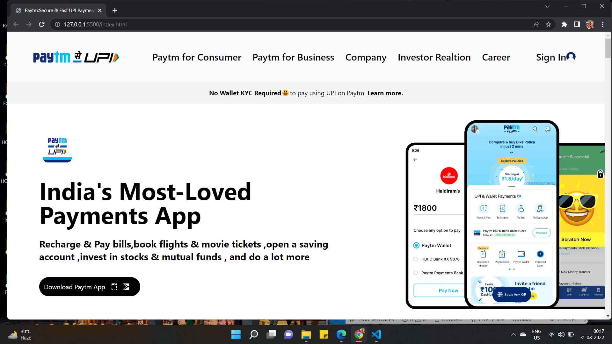
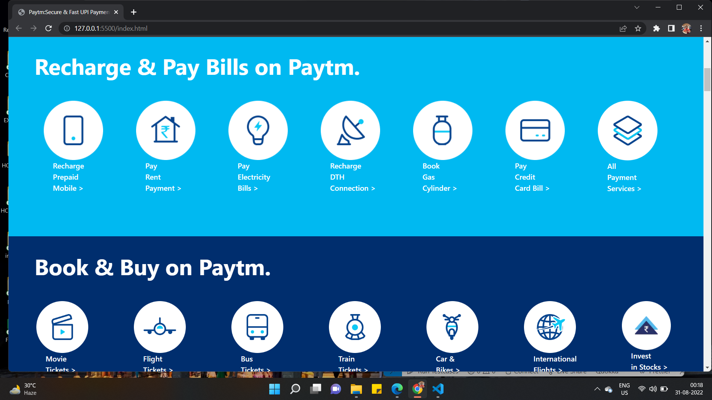
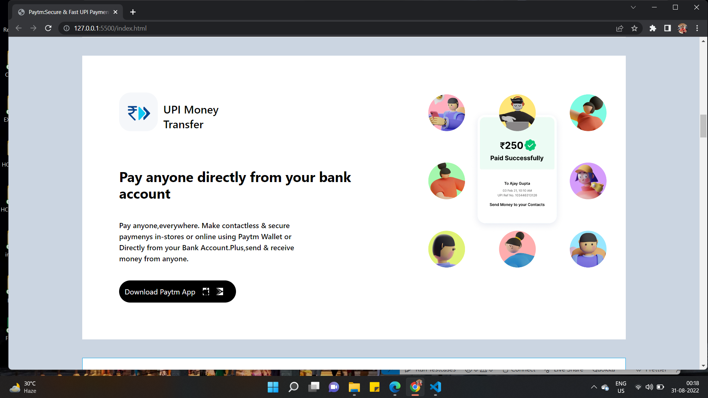
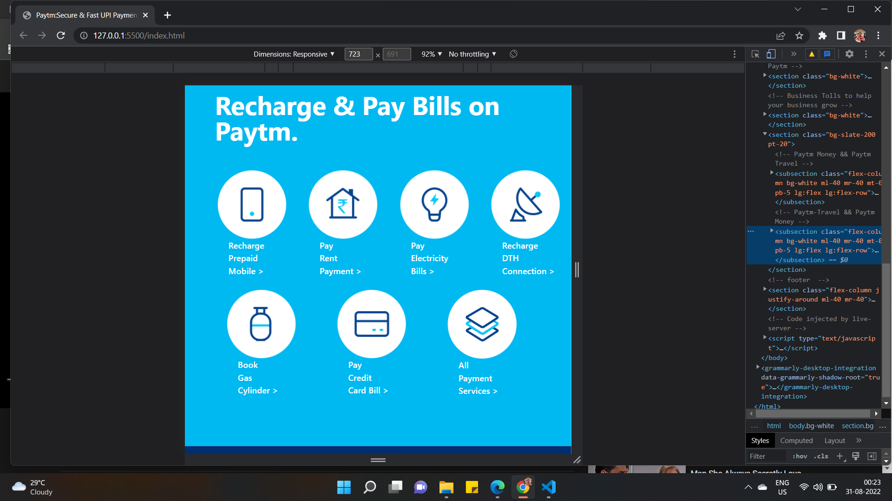
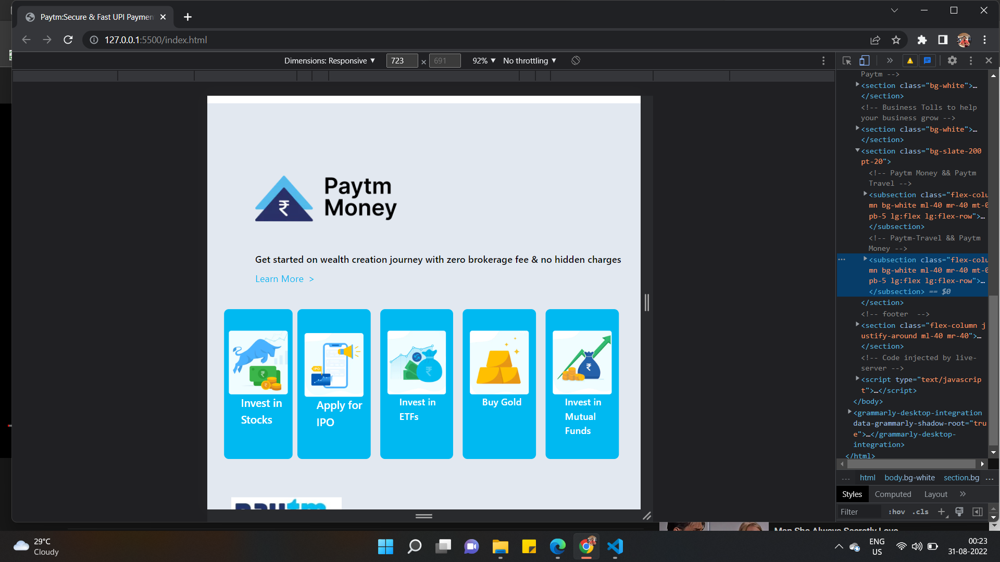

# Paytm Homepage Design Clone

I have cloned the [Paytm](https://paytm.com/) website using HTML and TAILWIND CSS only.

## Tech Stack:

### `HTML`
### `TAILWIND CSS`

***
### Check the live website [here]()

***
## My Learnings 
- Learned more classes in Tailwind.
- Learned flexbox concept in Tailwind .
- Used flexbox to make website responsive
- Implemented hover animations.

### How the website :

### Youtube Demo-link [Youtube-link](https://youtu.be/xbLWr9gWDbU)

***

## [Manish Kumar](www.linkedin.com/in/manish-kumar-b0639a170)
## [FindCoder](https://www.findcoder.io/u/itmanishsingh)

